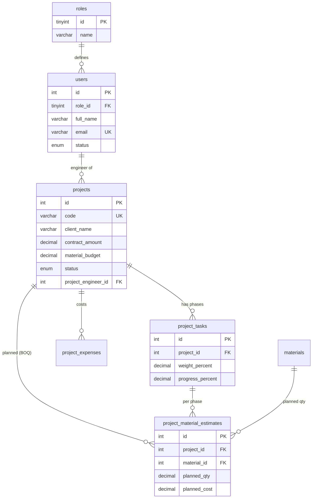
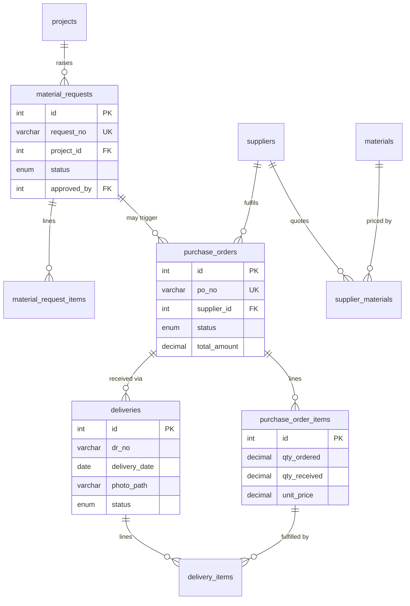
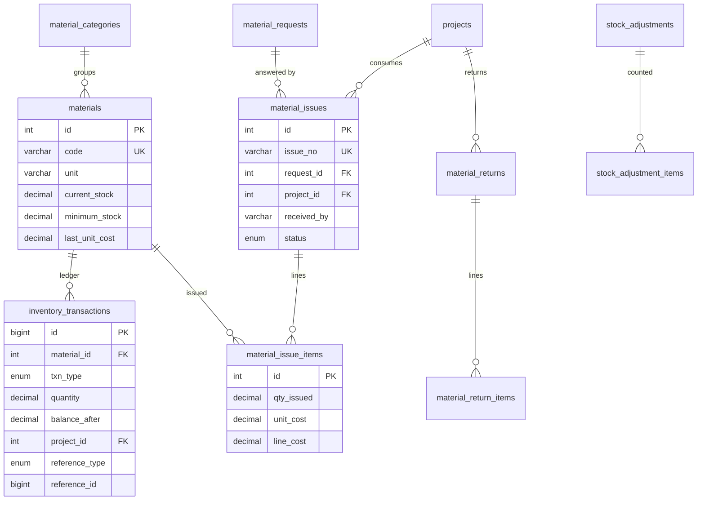

# Database Design
### Construction Project and Materials Management System (CPMMS)
CCE 106 · MySQL 8.0 · InnoDB · utf8mb4

---

## 1. What the database is built around

The system answers one question the firm cannot answer today:

> **What did this project plan to consume, what did it actually consume, and where did the difference go?**

Every table below exists to support that comparison, or to keep the trail that makes the
answer trustworthy.

Four design decisions drive the whole schema:

| # | Decision | Why |
|---|---|---|
| 1 | `inventory_transactions` is the **single source of truth** for stock | Stock becomes auditable. Any balance can be traced to the rows that produced it. `materials.current_stock` is a cached figure updated in the same DB transaction, never edited directly. |
| 2 | **Nothing is hard-deleted** | Documents carry a `status` (`posted` / `voided` / `cancelled`) and a reason. This is a financial trail — deleting a delivery receipt would erase evidence. |
| 3 | **Unit cost is snapshotted** at issuance (`material_issue_items.unit_cost`) | A supplier price change next month must never rewrite what a finished project cost. |
| 4 | **Stock may never go negative** | Enforced by `CHECK (balance_after >= 0)` in the ledger and `CHECK (current_stock >= 0)` on materials, plus an application check inside the transaction. |

---

## 2. Entity-relationship diagrams

Split into three views for legibility. Together they are one schema.

### 2.1 People and projects



### 2.2 Procurement — request to delivery



### 2.3 Inventory and costing



---

## 3. Table dictionary

### Access control
| Table | Purpose |
|---|---|
| `roles` | Admin, Project Engineer, Storekeeper |
| `users` | Accounts; `role_id` decides access. Passwords stored as bcrypt hashes. |

### Reference data
| Table | Purpose |
|---|---|
| `material_categories` | Cement & Aggregates, Steel & Rebar, Electrical… |
| `materials` | The catalogue. Holds `unit`, `minimum_stock` (reorder point), `current_stock` (cached), `last_unit_cost`. |
| `suppliers` | Vendor directory. |
| `supplier_materials` | Price quotes — one material may come from several suppliers, each at its own price and lead time. Dated, so price history is queryable. |

### Projects
| Table | Purpose |
|---|---|
| `projects` | Client, location, contract amount, **material budget**, dates, status, assigned engineer. |
| `project_tasks` | Phases. `weight_percent` is the phase's share of the project; `progress_percent` is entered by the engineer. Project progress is the weighted roll-up. |
| `project_material_estimates` | **Bill of Quantities** — the planned side of the variance comparison. |
| `project_expenses` | Materials posted automatically from issuances (`source='material_issue'`); labour, equipment and transport entered by hand. |

### Procurement
| Table | Purpose |
|---|---|
| `material_requests` / `_items` | Site asks for materials. `qty_issued` on each line tracks partial fulfilment. |
| `purchase_orders` / `_items` | What was ordered. `qty_received` accumulates across deliveries — partial delivery is normal, not an error. |
| `deliveries` / `delivery_items` | What actually arrived, with the supplier's DR number, who received it, and a photo. This is the third leg of the **three-way match** (PR ↔ PO ↔ DR). |

### Inventory
| Table | Purpose |
|---|---|
| `material_issues` / `_items` | Stock released to a project, signed for by a named person on site. `unit_cost` is snapshotted here. |
| `material_returns` / `_items` | Unused stock coming back. `disposition` separates `reusable` (returns to stock) from `damaged` (stays charged to the project). |
| `stock_adjustments` / `_items` | Physical count. Stores `system_qty` vs `counted_qty`; the variance becomes an `ADJUSTMENT` ledger row. |
| `inventory_transactions` | **The ledger.** One row per movement: `RECEIVED`, `ISSUED`, `RETURNED`, `DAMAGED`, `ADJUSTMENT`, `OPENING`. Signed `quantity`, `balance_after`, and a `reference_type`/`reference_id` pointing at the source document. |

### Support
| Table | Purpose |
|---|---|
| `activity_logs` | Who did what, to which record, when — approvals and voids especially. |
| `settings` | Costing method, low-stock alerting, wastage alert threshold. |

---

## 4. Business rules and where each is enforced

| # | Rule | Enforced by |
|---|---|---|
| 1 | Stock never goes negative | `CHECK (balance_after >= 0)`, `CHECK (current_stock >= 0)`, and a `SELECT … FOR UPDATE` check inside the issuance transaction |
| 2 | Stock is never edited directly | No UI path writes `current_stock`; corrections go through `stock_adjustments` |
| 3 | Every issuance answers an approved request | `material_issues.request_id` is `NOT NULL`; application rejects requests not in `approved` status |
| 4 | Partial deliveries are normal | `purchase_order_items.qty_received` accumulates; PO status moves to `partially_received` |
| 5 | Unit cost is snapshotted | `material_issue_items.unit_cost` copied at issue time; `line_cost` is a generated column |
| 6 | Reusable returns go back to stock | `RETURNED` ledger row (positive) |
| 7 | Damaged goods stay charged to the project | **No** ledger row — the stock already left at issuance; the damage is recorded on `material_return_items.disposition` and shows up as wastage |
| 8 | A project cannot close with open requests | Application check on status change to `completed` |
| 9 | Separation of duties | `requested_by ≠ approved_by`; storekeepers cannot approve |
| 10 | No hard deletes | `status` + `void_reason` columns; FKs use `ON DELETE RESTRICT` |

**Concurrency note.** Two storekeepers issuing the last stock at the same time is handled by
locking the material row (`SELECT … FOR UPDATE`) inside the issuance transaction, not by a
check in the interface. This is worth saying out loud in a defence.

---

## 5. Normalization

The schema is in **third normal form**:

- **1NF** — every column holds a single value. A request for five materials is five rows in
  `material_request_items`, not a comma-separated list.
- **2NF** — every non-key column depends on the whole key. Line-item tables (`*_items`) carry
  only what belongs to the line; document-level facts (dates, approver, status) live on the
  header.
- **3NF** — no transitive dependencies. `material_issue_items` stores `qty_issued` and
  `unit_cost`; `line_cost` is a *generated* column, so the product is never stored
  independently of its factors.

**Two deliberate denormalizations**, both justified:

1. `materials.current_stock` duplicates the ledger sum. Kept for read performance on every
   stock screen; guaranteed correct by updating it inside the same transaction, and provable
   at any time through `v_stock_check`.
2. `inventory_transactions.balance_after` stores the running balance. Kept so a printed stock
   card matches what the system showed on that date.

---

## 6. Views the reports read from

| View | Answers |
|---|---|
| `v_stock_check` | Current stock per material, the ledger's own total, the difference between them, and whether the item is at its reorder point. **`difference` must always be 0** — it is the schema's self-test. |
| `v_project_material_variance` | Planned vs actual quantity and cost per material per project, with variance % — the core report. |
| `v_project_cost_summary` | Budget, material cost to date, other expenses, remaining budget, and weighted progress per project. |

Example — materials a project has overrun by more than 10%:

```sql
SELECT project_name, material_name, planned_qty, actual_qty, variance_percent
FROM   v_project_material_variance
WHERE  variance_percent > 10
ORDER  BY variance_percent DESC;
```

Example — low stock for the dashboard:

```sql
SELECT code, name, cached_stock, minimum_stock
FROM   v_stock_check
WHERE  is_low_stock = 1
ORDER  BY cached_stock ASC;
```

---

## 7. Status of this design

Both SQL files parse cleanly against the MySQL 8 dialect (31 schema statements, 62 seed
statements, 25 tables), with every foreign key resolving to a real column and every INSERT
matching its column list. They have **not yet been executed against a live MySQL server** —
that happens the first time you import them, and any runtime issue will surface there.
